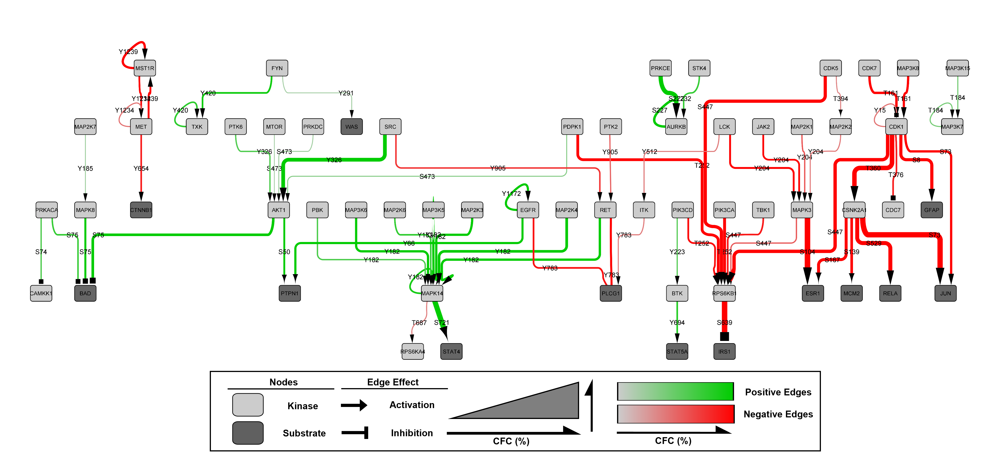

# 🗺 MAPPINGS v0.0.1

## Mapping and Analysis of Phosphorylation Pathways Identified through Network/Graph Signalling

MAPPINGS is a tool for the deconvolution of complex phosphorylation-based signalling datasets. It was designed to use antibody microarray datasets (eg. Kinexus KAM antibody microarrays), though any comparative dataset (control vs treated/infected) can be analysed. The MAPPINGS tool seeks to identify pathways of consistent phosphorylation signalling changes in a comparative dataset and rapidly identify lead networks for subsequent validation and exploration. The program functions through a random trails-based function which is influenced by the change in signals observed. First described by J. Adderley and F. O’Donoghue in MAPPINGS v1.0, a tool for network analysis of large phospho-signalling datasets: application to host erythrocyte response to Plasmodium infection (paper link).

**Figure 1:** Kinases and substrates are represented as nodes (dark nodes = substrates, light nodes = kinases) and phosphorylation events are represented as edges, which are designated with the specific phosphorylation site. Edges are represented in a colour gradient from grey to green (positive edges) and grey to red (negative edges) and a size gradient which corresponds to the percentage change from the control network trails (%CFC). The effect of the edge is represented in the arrowhead (arrow = activation, square = inhibition).

Designed and programmed with love by Dr. Jack Adderley and Finn O'Donoghue.

## Installation

	pip install mappings

If this doesn’t work, you may not have pip installed. Click here for a guide on how to install pip (Link to guide someone to install pip).

## Usage

	mappings [OPTIONS] ARRAY_DATA_PATH OUTPUT_PATH

or 

	python -m mappings [OPTIONS] ARRAY_DATA_PATH OUTPUT_PATH

### Options

	  --nwalks INTEGER                Number of walks.
	  --connection_network_path PATH  Network of known phosphorylation connections.

## Input / Output Specification

### Array Data

CSV file with headers:

**Uniprot ID** – (eg. Q9Y6R4) Must be accurate as this is what is used to map the dataset into the known interaction network.

**Protein**  – This can be in any form

**Phospho Site (Human)** – This is the antibodies recognised phosphosite, in the form (Y1234 or S234 or T564, combinations of Y1234+Y1235 or S235/T537 are accepted and will be split during the analysis into the individual phosphosites.

**UMean**  – mean control signal/value (mean of technical duplicates or of biological duplicates if available). Can be performed on single none replicated signal if desired.

**UMean Error (%)**  – mean control signal/value error as a percentage (Error range between replicates / mean signal/value * 100) – if performed on a single replicate fill this column with ‘0’

**TMean**  – mean treated/infected signal/value (mean of technical duplicates or of biological duplicates if available). Can be performed on single none replicated signal if desired.

**TMean Error (%)**  – mean treated/infected signal/value error as a percentage (Error range between replicates / mean signal/value * 100) – if performed on a single replicate fill this column with ‘0’

### Output Data

The output will be in CSV file format with a number of headers;

The most important headers for further visualisation or analysis are ‘Kinase’ ‘Substrate’ ‘Phosphosite’ ‘Change (%) ‘Log2FoldChange’ and ‘Substrate_effect’  

For visualisation of the output network, we recommend using Cystoscopy (link). To import the network, select file  import  Network from file, select the MAPPINGS analysis output. In the pop-up window click on ‘Kinase’ and select ‘Source Node (green circle), click on Substrate and select ‘Target Node’ (Orange bullz-eye) and ‘Phosphosite’ and select ‘Interaction type (purple triangle).

The network will render and using the Style tab the network can be visually customised to desired design. To use our custom style (download here) .

For use in Cytoscape or some other analysis program.

### Connection  Network
Accumulated from literature reports. Updated version may be available under `data/input/NetworkComplete.csv`
Please email the authors, or submit a pull request to update this file with any new data.

CSV file with headers:
- Phosphosite
- Kinase_uniprot_ID
- Substrate_uniprot_ID
- SubID_phosphosite
- Substrate_effect
- Kinase
- Substrate

## Publications
 - ...et al. 2021
 - [Review by highly respected bioinformatics group et al., 2022](https://www.google.com/search?q=most+important+bioinformatics+tools+of+all+time)