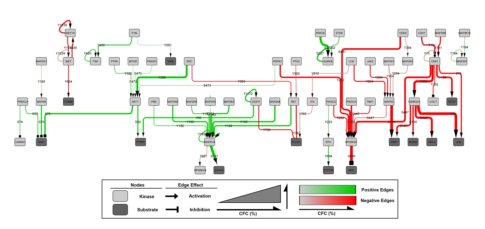

# 🗺 MAPPINGS v0.0.1

## Mapping and Analysis of Phosphorylation Pathways Identified through Network/Graph Signalling

MAPPINGS is a tool for the deconvolution of complex phosphorylation-based signalling datasets. It was designed to use antibody microarray datasets (eg. Kinexus KAM antibody microarrays), though any comparative dataset (control vs treated/infected) can be analysed. The MAPPINGS tool seeks to identify pathways of consistent phosphorylation signalling changes in a comparative dataset and rapidly identify lead networks for subsequent validation and exploration. The program functions through a random trails-based function which is influenced by the change in signals observed. First described by J. Adderley and F. O’Donoghue in MAPPINGS v1.0, a tool for network analysis of large phospho-signalling datasets: application to host erythrocyte response to *Plasmodium* infection ([Adderley et al., 2021](https://www.biorxiv.org/content/10.1101/2021.05.07.443051v1)).

 - **Figure 1:** Kinases and substrates are represented as nodes (dark nodes = substrates, light nodes = kinases) and phosphorylation events are represented as edges, which are designated with the specific phosphorylation site. Edges are represented in a colour gradient from grey to green (positive edges) and grey to red (negative edges) and a size gradient which corresponds to the percentage change from the control network trails (%CFC). The effect of the edge is represented in the arrowhead (arrow = activation, square = inhibition).

Designed and programmed with love by Dr. Jack Adderley and Finn O'Donoghue.

## Installation

	pip install mappings

If this doesn’t work, you may not have pip installed. - Note you will also need python install, see dependencies.

####Dependencies:

- [Python ](https://www.python.org/) - this will include pip.

- [pip](https://pip.pypa.io/en/stable/installation/) for a guide on how to install pip.

## Usage
#### on Linux and MacOS

	mappings [OPTIONS] ARRAY_DATA_PATH OUTPUT_PATH

#### or Windows

	python -m mappings [OPTIONS] ARRAY_DATA_PATH OUTPUT_PATH

Note: If you drag and drop your data file.csv it will fill the PATH for you.

### Examples

    (Default settings) python -m mappings mappings_kinase_data.csv mappings_kinase_analysis.csv
    (Custom settings)  python -m mappings mappings_kinase_data.csv mappings_kinase_analysis.csv --nwalks 100000 --errorThreshold 0.5 --panNormaliser False 

### Options

Each of the following options has a default set. Therefore, they only need to be input if different values are desired. 

    --nwalks                   (INTEGER)    Number of walks, default = 1,000,000.
    --errorThreshold           (INTEGER)    Error threshold used to refine data used, default = 1.0, recommended range = 0 - 1.0, (1.0 = total error is not greater than signal, 0 = no removal of high error signals) 
    --lowSignalCutOff          (INTEGER)    Removal of low intensity signals, default = 1,000, recommended range = 500 - 1,500 for Kinexus antibody microarray datasets, can be move up or down depending on the desire output network size
    --panNormaliser            (BOOLEAN)    Normalises signals by available Pan-specific antibody data provided. Default = Yes (normalise)
    --minimumTrailLength              (INTEGER)    The minimum number of edges a walk is required to pass throguh to be counted as a trail, default = 3, range = 1+, reducing this will result in more complex outputs which are less focused on pathway identification
    --connection_network_path  (PATH)       Network of known phosphorylation connection network (a network is provided in data\input\NetworkComplete.csv).

## Input / Output Specification

### Array Data

CSV file with headers:

<ins>**UniprotID**</ins> – (eg. Q9Y6R4) Must be accurate as this is what is used to map the dataset into the known interaction network.

<ins>**AntibodyTarget**</ins>  – This can be in any form or left blank

<ins>**Phosphosite**</ins> – This is the antibodies recognised phosphosite, in the form (Y1234 or S234 or T564, combinations of Y1234+Y1235 or S235/T537 are accepted and will be split during the analysis into the individual phosphosites. If Pan-specific antibodies are included (to enable protein level normalisation) they need to be denoted with the term "Pan"

<ins>**ControlMean**</ins>  – Mean control signal/value (mean of technical duplicates or of biological duplicates if available). Can be performed on single none replicated signal if desired.

<ins>**ControlError(%)**</ins>  – Mean control signal/value error as a percentage (Error range between replicates / mean signal/value * 100) – if performed on a single replicate fill this column with ‘0’

<ins>**TreatedMean**</ins>  – Mean treated/infected signal/value (mean of technical duplicates or of biological duplicates if available). Can be performed on single none replicated signal if desired.

<ins>**TreatedError(%)**</ins>  – Mean treated/infected signal/value error as a percentage (Error range between replicates / mean signal/value * 100) – if performed on a single replicate fill this column with ‘0’

### Output Data

The output will be in CSV file format with the following default headers;

 - Kinase 
 - Substrate
 - Phosphosite
 - Change(%)
 - Log2FoldChange
 - Substrate_effect

The following additional headers can be selected;

 - Control_edge_usage
 - Treated_edge_usage
 

     --edgeUsage    (FLAG)    Add edge usage numbers to output .csv, not required for cytoscape rendering

For visualisation of the output network, we recommend using [Cytoscape](https://cytoscape.org/). 

 - To import the network, select file - import - network from file, select the MAPPINGS analysis output. In the pop-up window click on ‘Kinase’ and select ‘Source Node (green circle), click on Substrate and select ‘Target Node’ (orange bullseye) and ‘Phosphosite’ and select ‘Interaction type' (purple triangle).

 - The network will render and using the Style tab the network can be visually customised to desired design. To use our custom style [Cytoscape Style](mappings/data/MAPPINGSCytoscapeStyle.xml).

### Connection  Network
The phosphorylation network used here as a backbone for the MAPPINGS analysis is an accumulated from literature reports and has been updated to include further connections and phosphorylation effects (see [Adderley et al., 2021](https://www.biorxiv.org/content/10.1101/2021.05.07.443051v1)) and original network ([PhosphoAtlas](https://pubmed.ncbi.nlm.nih.gov/26921330/)). Updated version may be available under data/input/NetworkComplete.csv Please email the authors, or submit a pull request to update this file with any new data. Alternatively, additional connections can be amended into the NetworkComplete.csv if desired.

### Citation
 
 - [Adderley, J. D., O’Donoghue, F., Doerig, C. & Davis, S. Network analysis of large phospho-signalling datasets: application to Plasmodium-erythrocyte interactions. bioRxiv, 2021](https://www.biorxiv.org/content/10.1101/2021.05.07.443051v1)